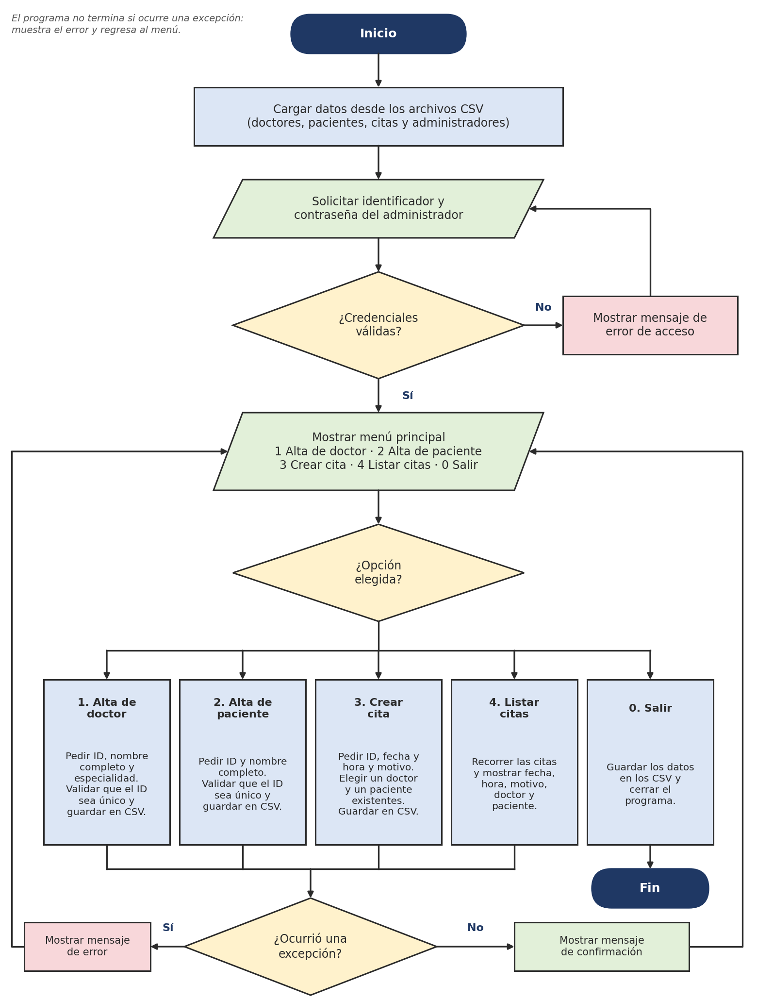
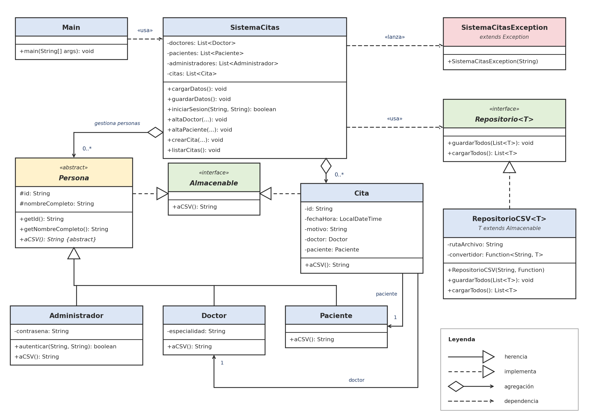

# Proyecto

## Diagrama de flujo

Este es el diagrama de flujo elaborado en la primera entrega (Avance 1):



### Cambios de la implementación respecto al diseño original

| Diseño del Avance 1 | Implementación final | Motivo |
|---|---|---|
| Si no hay administradores, se agrega uno inicial | El programa pide **crear el primer administrador** con su propia contraseña | Evita una contraseña predeterminada que cualquiera podría adivinar |
| Menú con 4 opciones y salir | Se agregó la opción **5. Alta de administrador** | Sin ella, solo se podría tener un administrador |
| Las contraseñas se comparan directamente | Se guardan con **sal y PBKDF2** | No guardar contraseñas en texto plano |
| `Function<String, T>` como convertidor | Interfaz propia `Convertidor<T>` | Poder lanzar `SistemaCitasException` al leer una línea dañada |
| Un error al cargar datos solo se muestra | Si no se puede acceder a la carpeta `db`, el programa explica el problema y termina | Evita trabajar sin poder guardar |
| — | Se agregaron las clases `Validaciones`, `UtilCSV`, `Consola` y `EntradaTerminadaException` | Separar validaciones, lectura de CSV y entrada/salida |

## Diagrama de clases del diseño original



## Organización en paquetes

| Paquete | Contenido |
|---|---|
| `consultorio` | `Main`: punto de entrada y menú |
| `consultorio.excepciones` | `SistemaCitasException` |
| `consultorio.modelo` | `Almacenable`, `Persona`, `Doctor`, `Paciente`, `Administrador`, `Cita`, `Validaciones` |
| `consultorio.persistencia` | `Repositorio`, `RepositorioCSV`, `Convertidor`, `UtilCSV` |
| `consultorio.servicio` | `SistemaCitas`: reglas de negocio |
| `consultorio.ui` | `Consola`, `EntradaTerminadaException` |

## Descripción de las clases

### `Main`

**Propósito:** punto de entrada. Carga los datos, pide el acceso del administrador y muestra el menú principal. Captura los errores para que el programa no se cierre.

| Variable | Tipo | Descripción |
|---|---|---|
| `CARPETA_DB_PREDETERMINADA` | `String` (constante) | Nombre de la carpeta de datos: `"db"` |

| Método | Descripción |
|---|---|
| `main(String[] args)` | Lee la carpeta de datos (argumento opcional) y llama a `ejecutar` |
| `ejecutar(InputStream, PrintStream, Path)` | Ejecuta el programa completo. Está separado de `main` para poder probarlo con entrada y salida simuladas |
| `crearPrimerAdministrador(...)` | Pide los datos del primer administrador hasta que sean válidos |
| `iniciarSesion(...)` | Pide identificador y contraseña hasta que sean correctos |
| `ciclo(...)` | Repite el menú hasta elegir la opción 0; muestra los errores sin cerrar el programa |
| `mostrarMenu(...)`, `ejecutarOpcion(...)` | Muestran el menú y ejecutan la opción elegida |
| `altaAdministrador`, `altaDoctor`, `altaPaciente`, `crearCita`, `listarCitas` | Pantallas de cada opción del menú: leen los datos y llaman a `SistemaCitas` |

### `SistemaCitas` (paquete `servicio`)

**Propósito:** guarda en memoria los datos, aplica las reglas de negocio y los persiste en los archivos CSV. Es la clase central del sistema.

| Variable | Tipo | Descripción |
|---|---|---|
| `ARCHIVO_ADMINISTRADORES`, `ARCHIVO_DOCTORES`, `ARCHIVO_PACIENTES`, `ARCHIVO_CITAS` | `String` (constantes) | Nombres de los archivos de datos |
| `repositorioAdministradores`, `repositorioDoctores`, `repositorioPacientes`, `repositorioCitas` | `RepositorioCSV<...>` | Leen y escriben cada archivo |
| `administradores`, `doctores`, `pacientes`, `citas` | `List<...>` | Datos cargados en memoria |
| `advertencias` | `List<String>` | Avisos de la última carga (líneas dañadas o repetidas que se omitieron) |

| Método | Descripción |
|---|---|
| `SistemaCitas(Path carpetaDb)` | Prepara los repositorios en la carpeta indicada |
| `cargarDatos()` | Carga todos los archivos; los que falten se regeneran vacíos. Las citas se cargan al final porque necesitan a su doctor y a su paciente |
| `guardarDatos()` | Guarda todas las listas en sus archivos |
| `getAdvertencias()` | Devuelve los avisos de la última carga |
| `altaAdministrador(id, nombre, contrasena)` | Registra un administrador y lo guarda. Rechaza identificadores repetidos |
| `iniciarSesion(id, contrasena)` | Devuelve el administrador si las credenciales son correctas, o `null` |
| `hayAdministradores()`, `buscarAdministrador(id)`, `getAdministradores()` | Consultas sobre los administradores |
| `altaDoctor(id, nombre, especialidad)` | Registra un doctor y lo guarda. Rechaza identificadores repetidos |
| `buscarDoctor(id)`, `getDoctores()` | Consultas sobre los doctores (la búsqueda no distingue mayúsculas) |
| `altaPaciente(id, nombre)` | Registra un paciente y lo guarda. Rechaza identificadores repetidos |
| `buscarPaciente(id)`, `getPacientes()` | Consultas sobre los pacientes |
| `crearCita(id, fechaHora, motivo, idDoctor, idPaciente)` | Crea una cita. Verifica que el doctor y el paciente existan, que el identificador no se repita, que la fecha no sea pasada y que ni el doctor ni el paciente tengan otra cita a esa hora |
| `listarCitas()` | Devuelve las citas ordenadas por fecha y hora |
| `buscarCita(id)` | Busca una cita por identificador |

Si falla el guardado en un archivo, el registro se quita de la memoria para que los datos y el archivo no queden distintos.

### `Almacenable` (interfaz, paquete `modelo`)

**Propósito:** contrato de todo objeto que se guarda en un archivo.

| Método | Descripción |
|---|---|
| `String aCSV()` | Convierte el objeto en una línea CSV |

### `Persona` (clase abstracta, paquete `modelo`)

**Propósito:** base común de `Doctor`, `Paciente` y `Administrador`. Implementa `Almacenable`. Es abstracta porque siempre se trabaja con uno de sus tipos concretos.

| Variable | Tipo | Descripción |
|---|---|---|
| `LONGITUD_MAXIMA_NOMBRE` | `int` (constante) | 80 caracteres |
| `id` | `String` | Identificador único |
| `nombreCompleto` | `String` | Nombre completo |

| Método | Descripción |
|---|---|
| `Persona(id, nombreCompleto)` | Valida y guarda los datos; lanza `SistemaCitasException` si no son válidos |
| `getId()`, `getNombreCompleto()` | Consultas |
| `aCSV()` (abstracto) | Cada tipo decide qué columnas guarda |

### `Doctor` (extiende `Persona`)

**Propósito:** doctor del consultorio.

| Variable | Tipo | Descripción |
|---|---|---|
| `ENCABEZADO` | `String` (constante) | Primera línea de `doctores.csv` |
| `LONGITUD_MAXIMA_ESPECIALIDAD` | `int` (constante) | 60 caracteres |
| `especialidad` | `String` | Especialidad médica |

| Método | Descripción |
|---|---|
| `Doctor(id, nombreCompleto, especialidad)` | Valida y crea el doctor |
| `getEspecialidad()` | Consulta |
| `aCSV()` | `id,nombreCompleto,especialidad` |
| `desdeCSV(String linea)` (estático) | Construye un doctor a partir de una línea del archivo |
| `toString()` | `D1 - Ana López (Pediatría)` |

### `Paciente` (extiende `Persona`)

**Propósito:** paciente del consultorio.

| Variable | Tipo | Descripción |
|---|---|---|
| `ENCABEZADO` | `String` (constante) | Primera línea de `pacientes.csv` |

| Método | Descripción |
|---|---|
| `Paciente(id, nombreCompleto)` | Valida y crea el paciente |
| `aCSV()` | `id,nombreCompleto` |
| `desdeCSV(String linea)` (estático) | Construye un paciente a partir de una línea del archivo |
| `toString()` | `P1 - María García` |

### `Administrador` (extiende `Persona`)

**Propósito:** usuario con permiso para entrar al sistema.

| Variable | Tipo | Descripción |
|---|---|---|
| `ENCABEZADO` | `String` (constante) | Primera línea de `administradores.csv` |
| `LONGITUD_MINIMA_CONTRASENA`, `LONGITUD_MAXIMA_CONTRASENA` | `int` (constantes) | 6 y 64 caracteres |
| `ITERACIONES`, `BITS_DE_CLAVE` | `int` (constantes) | Parámetros de PBKDF2: 65 536 iteraciones, clave de 256 bits |
| `ALEATORIO` | `SecureRandom` | Genera la sal de cada contraseña |
| `sal` | `String` | Sal aleatoria en Base64 |
| `hashContrasena` | `String` | Resultado de PBKDF2 en Base64. La contraseña original no se guarda |

| Método | Descripción |
|---|---|
| `crear(id, nombre, contrasena)` (estático) | Valida los datos, genera la sal y calcula el hash |
| `autenticar(id, contrasena)` | Verifica las credenciales comparando el hash en tiempo constante |
| `aCSV()` | `id,nombreCompleto,sal,hashContrasena` |
| `desdeCSV(String linea)` (estático) | Construye un administrador a partir de una línea del archivo |

### `Cita` (paquete `modelo`)

**Propósito:** cita médica, relacionada con exactamente un doctor y un paciente. Implementa `Almacenable`.

| Variable | Tipo | Descripción |
|---|---|---|
| `ENCABEZADO` | `String` (constante) | Primera línea de `citas.csv` |
| `LONGITUD_MAXIMA_MOTIVO` | `int` (constante) | 120 caracteres |
| `FORMATO_ARCHIVO`, `FORMATO_PANTALLA` | `DateTimeFormatter` | Formatos de fecha: `uuuu-MM-dd HH:mm` en el archivo y `dd/MM/uuuu HH:mm` para el usuario (ambos estrictos: rechazan fechas como 31/02) |
| `id` | `String` | Identificador único |
| `fechaHora` | `LocalDateTime` | Fecha y hora de la cita |
| `motivo` | `String` | Motivo de la consulta |
| `doctor` | `Doctor` | Doctor asignado |
| `paciente` | `Paciente` | Paciente asignado |

| Método | Descripción |
|---|---|
| `Cita(id, fechaHora, motivo, doctor, paciente)` | Valida los datos; el doctor y el paciente son obligatorios |
| `getId()`, `getFechaHora()`, `getMotivo()`, `getDoctor()`, `getPaciente()` | Consultas |
| `aCSV()` | `id,fechaHora,motivo,idDoctor,idPaciente`: en el archivo solo se guardan los identificadores del doctor y del paciente |
| `desdeCSV(linea, buscarDoctor, buscarPaciente)` (estático) | Reconstruye la cita buscando a su doctor y a su paciente; falla si alguno ya no existe |
| `parsearFechaHora(String)` (estático) | Convierte el texto del usuario (`dd/MM/aaaa HH:mm`) en una fecha |
| `fechaHoraParaMostrar()` | Fecha con el formato que ve el usuario |

### `Validaciones` (paquete `modelo`)

**Propósito:** reglas de validación compartidas.

| Método | Descripción |
|---|---|
| `identificador(String)` | Acepta solo letras, números, guion y guion bajo (máximo 20); devuelve el valor sin espacios sobrantes |
| `textoObligatorio(valor, campo, maximo)` | Verifica que el texto no esté vacío ni exceda el máximo |

### `Repositorio<T>` (interfaz, paquete `persistencia`)

**Propósito:** define cómo se guardan y leen los objetos, sin depender del formato. Permite cambiar a JSON o XML sin modificar `SistemaCitas`.

| Método | Descripción |
|---|---|
| `inicializar()` | Crea el almacén si falta |
| `guardarTodos(List<T>)` | Reemplaza el contenido |
| `cargarTodos()` | Devuelve todos los objetos guardados |

### `RepositorioCSV<T extends Almacenable>`

**Propósito:** implementa `Repositorio` con archivos CSV en UTF-8.

| Variable | Tipo | Descripción |
|---|---|---|
| `ruta` | `Path` | Ubicación del archivo |
| `encabezado` | `String` | Primera línea del archivo |
| `convertidor` | `Convertidor<T>` | Convierte cada línea en un objeto |
| `advertencias` | `List<String>` | Líneas dañadas que se omitieron en la última carga |

| Método | Descripción |
|---|---|
| `inicializar()` | Crea la carpeta y el archivo con su encabezado si no existen |
| `guardarTodos(lista)` | Escribe un archivo temporal y lo reemplaza al terminar |
| `cargarTodos()` | Regenera el archivo si falta, ignora la marca BOM de los editores de Windows y omite las líneas dañadas |
| `getAdvertencias()`, `getRuta()` | Consultas |

### `Convertidor<T>` (interfaz funcional)

| Método | Descripción |
|---|---|
| `T convertir(String linea)` | Convierte una línea del archivo en un objeto; lanza `SistemaCitasException` si el formato no es válido |

### `UtilCSV`

**Propósito:** escribir y leer líneas CSV respetando las comillas. Un nombre como `García Soto, María` se guarda como `"García Soto, María"` sin romper las columnas.

| Método | Descripción |
|---|---|
| `escapar(String)` | Prepara un campo para escribirlo |
| `unir(String...)` | Une campos en una línea CSV |
| `dividir(String)` | Separa una línea en sus campos; falla si hay comillas sin cerrar |

### `SistemaCitasException`

**Propósito:** excepción propia del sistema (extiende `Exception`). Representa los errores esperables y siempre trae un mensaje pensado para el usuario.

### `Consola` (paquete `ui`)

**Propósito:** concentra la lectura del teclado y la escritura en pantalla para que el resto del programa no dependa de `System.in`, y así se pueda probar con datos simulados.

| Variable | Tipo | Descripción |
|---|---|---|
| `entrada` | `Scanner` | Lee las líneas escritas por el usuario |
| `salida` | `PrintStream` | Escribe en pantalla |
| `terminalReal` | `boolean` | Indica si se puede ocultar la contraseña al escribirla |

| Método | Descripción |
|---|---|
| `leerTexto(mensaje)` | Muestra el mensaje y lee una línea; lanza `EntradaTerminadaException` si ya no hay más datos |
| `leerContrasena(mensaje)` | Igual, pero oculta lo escrito cuando se usa una terminal real |
| `leerEntero(mensaje)` | Lee un número entero; lanza `SistemaCitasException` si no lo es |
| `mostrar(texto)`, `mostrarError(texto)` | Escriben en pantalla (los errores llevan el prefijo `[ERROR]`) |

### `EntradaTerminadaException`

Se lanza cuando ya no hay datos de entrada (por ejemplo, con Ctrl+D). Permite cerrar el programa de forma ordenada en lugar de quedarse en un ciclo infinito.

## Formato de los archivos

```text
doctores.csv         id,nombreCompleto,especialidad
pacientes.csv        id,nombreCompleto
citas.csv            id,fechaHora,motivo,idDoctor,idPaciente
administradores.csv  id,nombreCompleto,sal,hashContrasena
```
